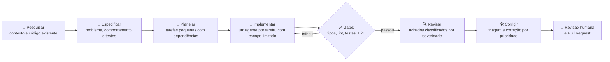

# 👨‍💻 Anderson Vilela
**Software Engineer | Desenvolvimento com IA: Spec-Driven Development & Harness Engineering**  
na [Vilela Technology](https://www.linkedin.com/company/vilela-technology/about/)

> 🇺🇸 *Software engineer who ships production code with AI agents. Specs, test harnesses and quality gates keep the output reliable, reviewed and maintainable.*

  
  
  
  
  
  
  

  
  
  
  
  
  

---

## 🎯 Sobre mim

Sou engenheiro de software full stack (TypeScript, Node.js, NestJS, React e Next.js) e **uso IA como parte central do meu processo de desenvolvimento**, não como autocompletar. Planejo com especificações, deixo agentes implementarem dentro de limites bem definidos e **valido tudo com testes, linters e revisão humana** antes de entregar.

Minha prioridade é **entregar software melhor e mais rápido, com a IA como ferramenta de trabalho**, e a responsabilidade pelo resultado continua sendo minha. Desenvolvi essa abordagem no [MBA em Engenharia de Software com IA da Full Cycle](https://ia.fullcycle.com.br/mba-ia/) e a aplico no dia a dia na [Vilela Technology](https://www.linkedin.com/company/vilela-technology/about/).

## 📈 Por que isso importa

A adoção de IA no desenvolvimento já é regra, mas a confiança no resultado não acompanha. Segundo o [Stack Overflow Developer Survey 2025](https://survey.stackoverflow.co/2025/ai):

- **84%** dos desenvolvedores usam ou planejam usar IA no desenvolvimento;
- **46%** não confiam na precisão do que a IA entrega;
- **66%** citam como maior frustração soluções "quase certas, mas não totalmente".

É nessa lacuna que eu atuo: **transformar a velocidade da IA em código confiável**, com especificação clara, contexto controlado e verificação objetiva.

---

## 🔄 Como eu trabalho

| Etapa | O que faço na prática |
| :--- | :--- |
| **Especificar** | Antes de qualquer código, defino o problema a resolver, o comportamento esperado, os casos de borda e o contrato de uso (**Spec-Driven Development**). Cada decisão difícil de reverter fica registrada com suas alternativas, e o agente nunca implementa "no escuro". |
| **Planejar** | Transformo a especificação em um grafo de tarefas pequenas, com dependências explícitas. A primeira tarefa já entrega o menor caminho que resolve o problema, e cada teste previsto tem um único responsável. |
| **Delegar com limites** | Um orquestrador coordena a execução: cada tarefa roda em uma sessão isolada, com escopo restrito de arquivos e comandos. Features independentes andam em paralelo, cada agente em seu próprio terminal e worktree, todos gerenciados no **Herdr**. |
| **Verificar com evidência** | Type-check, lint, hooks de pre-commit e testes (unitários, integração e E2E com Playwright) funcionam como *quality gates*. Uma tarefa só termina com a evidência registrada, e o que o agente diz não conta como prova. |
| **Revisar e corrigir** | Cada rodada de revisão confronta o código com a especificação e com os testes previstos, e classifica os achados por severidade. Cada achado passa por triagem (válido ou não) antes de ser corrigido. |
| **Preservar o contexto** | Mantenho memória compartilhada entre tarefas e contexto enxuto e atualizado, e entrego ao agente só o que ele precisa em cada etapa (*progressive disclosure*). |
| **Manter o controle** | Aprovo a especificação antes de implementar, reviso o diff, valido decisões de arquitetura e exijo aprovação humana antes de ações irreversíveis (migrações, commits, push). |

---

## 🛡️ Competências em foco

### Desenvolvimento com IA (AI-Assisted Development)
- Agentes de código no terminal: **Claude Code, Codex, OpenCode e Antigravity CLI**, com rules, memories e contexto configurados por projeto.
- **Orquestração de múltiplos agentes com [Herdr](https://herdr.dev/)**: vários agentes em paralelo, cada um em seu terminal e projeto, com status em tempo real e sessões que continuam rodando enquanto eu estou fora.
- **Skills (`SKILL.md`)** modulares com frontmatter YAML e *progressive disclosure*, e **servidores MCP** (Context7, PostgreSQL, Figma) integrados ao ambiente de desenvolvimento.
- IA para **debugging, análise de logs, refatoração, geração e auditoria de testes, code review e documentação**.

### Harness Engineering
Estrutura de contenção para que agentes produzam resultados previsíveis, sem degradar o código existente:
- **Enforcements mecânicos**: linters estritos, análise estática de tipos, hooks de pre-commit e gates de build que bloqueiam violações de padrão.
- **Avaliação funcional**: testes automatizados como esteira de validação, com critérios mensuráveis para considerar uma tarefa concluída.
- **Ciclos fechados de correção**: o agente roda os gates, lê o erro, diagnostica e corrige até passar, com *human-in-the-loop* nos pontos críticos.

### Context Engineering & Prompt Engineering
- Gestão da janela de contexto (truncamento, sumarização, *prompt caching*) e **design docs como contexto vivo**: PRD, RFC, ADR e diagramas C4/Mermaid.
- Prompts estruturados e versionados (CoT, ReAct, few-shot) com templates reutilizáveis por tipo de tarefa.

### Qualidade, Segurança & DevOps com IA
- Pipelines de **CI/CD** assistidos por IA, **DevSecOps** (SAST/DAST, análise de dependências) e boas práticas do **OWASP Top 10 for LLM** (prompt injection, guardrails).
- Observabilidade, resposta a incidentes e rascunho de *postmortems* com apoio de IA.

---

## 🧰 Stack

| Camada | Tecnologias e ferramentas |
| :--- | :--- |
| **Desenvolvimento com IA** | Claude Code, Codex, OpenCode, Antigravity CLI, Herdr (multi-agente), MCP, Skills, `AGENTS.md`, subagentes |
| **Metodologia** | Spec-Driven Development, TDD, PRD / RFC / ADR, C4 Model, Mermaid |
| **Qualidade & Testes** | Playwright (E2E), Jest, Vitest, ESLint, TypeScript strict, Git pre-commit hooks |
| **Back-End & APIs** | TypeScript, Node.js, NestJS, REST, WebSockets, OpenAPI |
| **Front-End & Design System** | Next.js (App Router), React, TailwindCSS, shadcn/ui, design tokens Figma → código via MCP |
| **Dados** | PostgreSQL, MongoDB, Redis, SQLite |
| **DevOps, Cloud & Segurança** | Docker, Docker Compose, GitHub Actions (CI/CD), GCP, AWS, DevSecOps |
| **IA aplicada** *(base sólida, não é meu foco principal)* | OpenAI SDK, LangChain.js, LangGraph.js, Google ADK, servidores MCP, A2A, LiteLLM, RAG |

---

## 🎓 Formação

- **MBA em Engenharia de Software com IA** (400 horas): *Full Cycle*, reconhecido pelo MEC.  
  Arquitetura para IA, metodologia e workflow para devs (SDD, Harness Engineering), desenvolvimento de aplicações e agentes, protocolos MCP/A2A e DevOps/SRE com IA.
- **Pós-Graduação em Desenvolvimento Full Stack**: Centro Universitário União das Américas Descomplica
- **Graduação em Análise e Desenvolvimento de Sistemas**: Centro de Ensino Superior de Maringá (UniCesumar)

<b>📚 Ver o currículo completo do MBA</b>

 

| # | Disciplina | Principais tópicos |
| :-: | :--- | :--- |
| 01 | Fundamentos de IA Generativa | Transformers, tokens, inferência, alucinação, modelos locais (Ollama) |
| 02 | Prompt Engineering | CoT, ReAct, prompt caching, versionamento, LLM-as-a-Judge |
| 03 | Arquitetura na Era da IA | 12-Factor Agents, acoplamento, caching, AI Gateways (LiteLLM), OWASP LLM |
| 04 | Design Docs com IA | PRD, RFC, ADR, C4 Model, Mermaid como contexto para a IA |
| 05 | Desenvolvimento de Software com IA | Cursor, Copilot, rules, memories, MCP, testes, debugging e refatoração |
| 06 | Desenvolvimento em Modo Agente | SDD, Harness Engineering, subagentes, skills, paralelização com tmux |
| 07 | Desenvolvimento de Aplicações com IA | NestJS, Next.js, Docker, TDD com IA, Figma via MCP, shadcn/ui |
| 08 | Desenvolvimento de Agentes | Google ADK, LangGraph, CrewAI, tools, subagentes, observabilidade |
| 09 | Protocolos de Comunicação | MCP (servidores customizados), Google A2A, Docker MCP Toolkit |
| 10 | DevOps e SRE com IA | Pipelines assistidos, DevSecOps, ChatOps, postmortems automatizados |
| 11 | Marketing Pessoal, Trabalho em Equipe e Empreendedorismo | Posicionamento, liderança e protagonismo profissional |

---

## 📫 Vamos conversar

- **LinkedIn:** [anderson-vilela](https://www.linkedin.com/in/anderson-vilela)
- **GitHub:** [anderson-vilela](https://github.com/anderson-vilela)
- **Email:** [andersonvilela.dev@gmail.com](mailto:andersonvilela.dev@gmail.com)

---

  💡 <i>"IA acelera a escrita do código. Especificação, contexto e verificação é que garantem que ele seja correto, auditável e confiável."</i>

